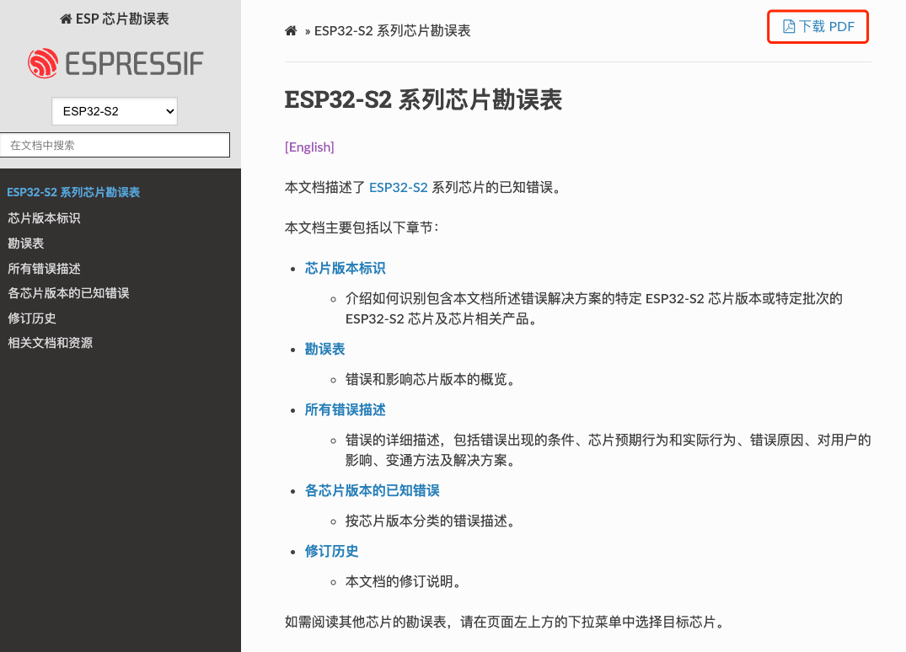
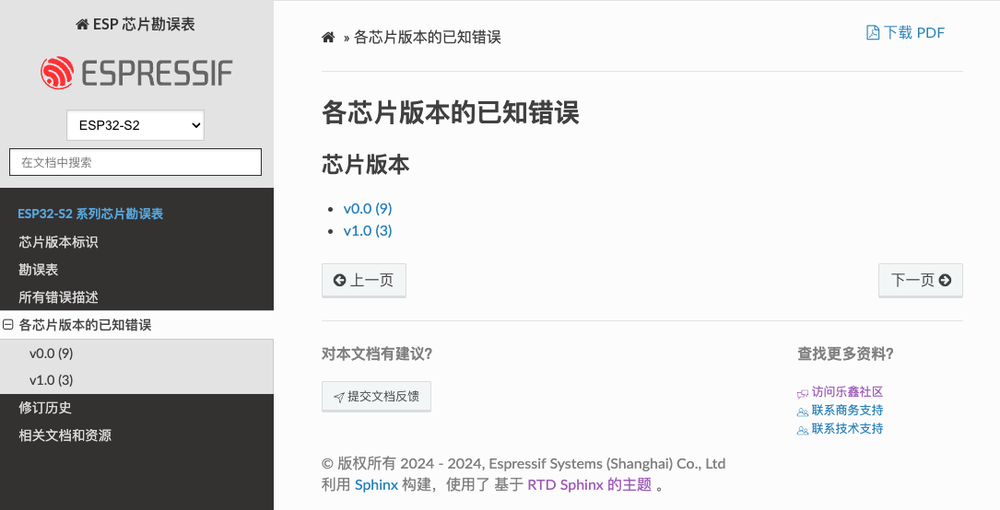

# ESP 芯片勘误表 ([English](README.md))

esp-chip-errata 仓库包含以下勘误表，记录了芯片已知的错误及解决方法：

- [ESP32 系列芯片勘误表](https://docs.espressif.com/projects/esp-chip-errata/zh_CN/latest/esp32/index.html)
- [ESP32-S2 系列芯片勘误表](https://docs.espressif.com/projects/esp-chip-errata/zh_CN/latest/esp32s2/index.html)
- [ESP32-C3 系列芯片勘误表](https://docs.espressif.com/projects/esp-chip-errata/zh_CN/latest/esp32c3/index.html)
- [ESP32-S3 系列芯片勘误表](https://docs.espressif.com/projects/esp-chip-errata/zh_CN/latest/esp32s3/index.html)
- [ESP32-C2 (ESP8684) 系列芯片勘误表](https://docs.espressif.com/projects/esp-chip-errata/zh_CN/latest/esp32c2/index.html)
- [ESP32-C6 系列芯片勘误表](https://docs.espressif.com/projects/esp-chip-errata/zh_CN/latest/esp32c6/index.html)
- [ESP32-H2 系列芯片勘误表](https://docs.espressif.com/projects/esp-chip-errata/zh_CN/latest/esp32h2/index.html)

## 功能特性

本仓库的主要功能如下：
- 多格式输出
    - 勘误表提供 **PDF** 和 **HTML** 两种格式。
    - 如需 PDF 格式，请点击 HTML 页面右上角的 "下载 PDF" 图标。
    
- 按芯片版本筛选错误描述
    - 如需查看特定芯片版本的错误描述，请在侧边栏中找到 "各芯片版本的已知错误"，然后选择芯片版本。
    - 括号中的数字表示每个芯片版本已知的错误数量。
    

## 贡献

我们欢迎您为勘误表文档提供改进建议！

如发现错误描述存在问题，请随时
- 点击 [HTML 文档页面](https://docs.espressif.com/projects/esp-chip-errata/zh_CN/latest/esp32c6/index.html) 底部的 “提交文档反馈” 图标
- 创建 [议题](https://github.com/espressif/esp-chip-errata/issues) 
- 创建 [拉取请求](https://github.com/espressif/esp-chip-errata/pulls)
