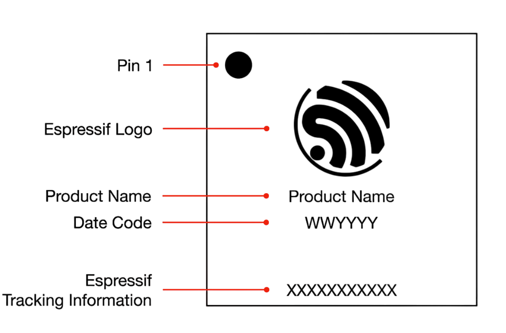
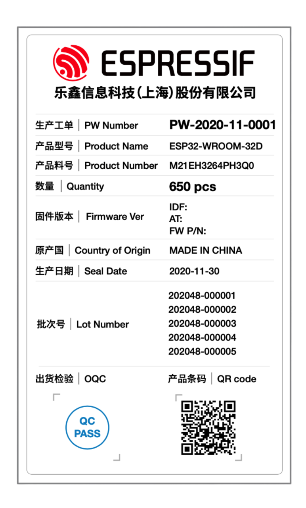

Chip Revision Identification
============================

:link_to_translation:`zh_CN:[中文]`

Espressif is introducing a new **vM.X** numbering scheme to indicate chip revisions. This guide outlines the structure of this scheme and provides information on chip errata and additional identification methods.

Chip Revision Numbering Scheme
------------------------------

The new numbering scheme **vM.X** consists of the major and minor numbers described below.

**M** – Major number, indicating the major revision of the chip product. If this number changes, it means the software used for the previous version of the product is incompatible with the new product, and the software version shall be upgraded for the use of the new product.

**X** – Minor number, indicating the minor revision of the chip product. If this number changes, it means the software used for the previous version of the product is compatible with the new product, and there is no need to upgrade the software.

The **vM.X** scheme replaces previously used chip revision schemes, including ECOx numbers, Vxxx, and other formats if any.

Primary Identification Methods
------------------------------

eFuse Bits
++++++++++

.. only:: not esp32

    The chip revision is encoded using two eFuse fields:

    .. include:: ./{IDF_TARGET_PATH_NAME}/efuse-field-identification.rst

.. only:: esp32

    The chip revision is encoded using four eFuse fields:

    .. include:: ./{IDF_TARGET_PATH_NAME}/efuse-field-identification.rst

Chip Marking
++++++++++++

-  **Espressif Tracking Information** line in chip marking

.. _fig-chip-marking:

    Chip Marking Diagram

.. include:: ./{IDF_TARGET_PATH_NAME}/chip-marking-identification.rst

Module Marking
++++++++++++++

- **Specification Identifier** line in module marking

  .. figure:: ../../_static/module-marking__EN.png
      :align: center
      :scale: 55%
      :alt: Module Marking Diagram

      Module Marking Diagram

.. include:: ./{IDF_TARGET_PATH_NAME}/module-marking-identification.rst

Additional Identification Methods
---------------------------------

Date Code
+++++++++

Some errors in the chip product don't need to be fixed at the silicon level, or in other words in a new chip revision.

In this case, the chip may be identified by **Date Code** in chip marking (see :ref:`fig-chip-marking`). For more information, please refer to `Espressif Chip Packaging Information <https://www.espressif.com/sites/default/files/documentation/espressif_chip_packaging_information_en.pdf>`__.

PW Number
+++++++++

Modules built around the chip may be identified by **PW Number** in product label (see :ref:`fig-PW-number`). For more information, please refer to `Espressif Module Packaging Information <https://www.espressif.com/sites/default/files/documentation/espressif_module_packaging_information_en.pdf>`__.

.. _fig-PW-number:

    Module Product Label

.. note::

  Please note that **PW Number** is only provided for reels packaged in aluminum moisture barrier bags (MBB).

ESP-IDF Release Compatibility
-----------------------------

Information about ESP-IDF release that supports a specific chip revision is provided in `Compatibility Between ESP-IDF Releases and Revisions of Espressif SoCs <https://github.com/espressif/esp-idf/blob/master/COMPATIBILITY.md>`__.

Related Documents
-----------------

- For more information about the chip revision upgrade and their identification of series products, please refer to `{IDF_TARGET_NAME} Product/Process Change Notifications (PCN) <https://www.espressif.com/en/support/documents/pcns?keys={IDF_TARGET_NAME}>`__.

- For more information about the chip revision numbering scheme, see `Compatibility Advisory for Chip Revision Numbering Scheme <https://www.espressif.com/sites/default/files/advisory_downloads/AR2022-005%20Compatibility%20Advisory%20for%20Chip%20Revision%20Numbering%20%20Scheme.pdf>`__.
